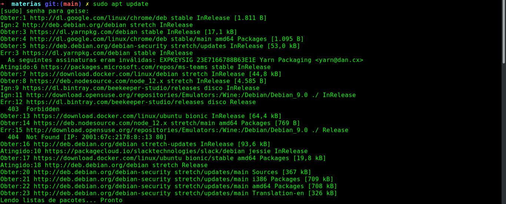
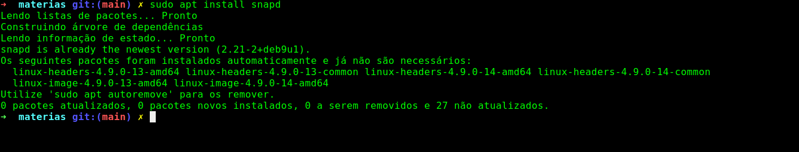
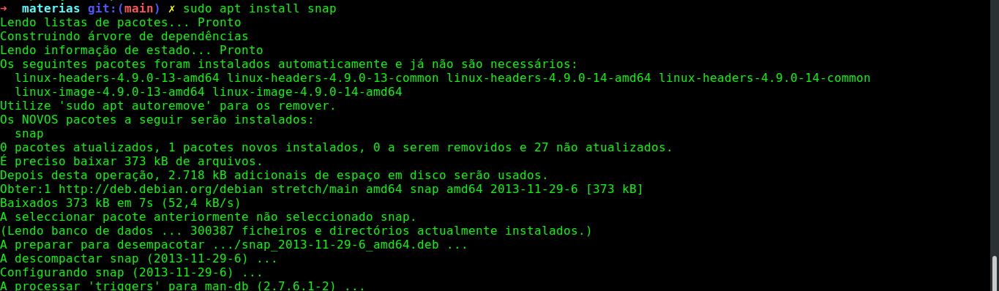
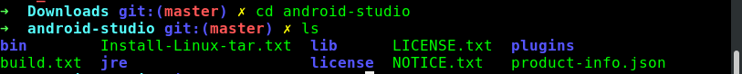
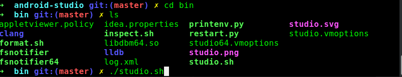
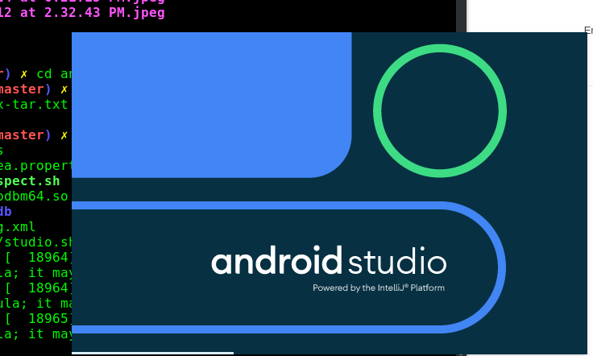

## 
 Tutorial de instalação do Android Studio no Debian 

Fala, galera!

Hoje vim trazer um tutorialzinho de instalaçao do Android Studio para quem, assim como eu, usa a distribuição Debian. Bora lá?

Bom, primeiramente, para instalar o Android Studio no Debian, nós vamos dar um update no sistema e instalat o snapd e, se eventualemnte, ocorrer um erro de dependência você segue ao passo 3, como mostro abaixo.

**Passo 01: sudo apt update**

Você verá algo com essa cara:

**Passo 02: sudo apt install snapd**

Como já possuo as dependências instaladas, a minha tela é esta abaixo, mas certamente pra você que ainda não tem, será diferente. Mas não se preocupe, vamos seguindo.

Se acusar erro de dependência, utilize o camando abaixo para a instalção do snap.

**Passo 03: sudo apt install snap**

Você verá algo assim:

Agora que temos nossas dependências instaladas, vamos a instalação do título desse tutorial: o Android Studio. 

Vamos precisar apenas do comando abaixo:

* **sudo snap install android-studio –classic**

Devido a instalação já ter sido realizada em minha máquina anteriormente, eu já posso acesar a pasta descompactada, como abaixo:

Agora é só entrar na pasta bin e digitar **./studio.sh** para executar a IDE. Veja abaixo:

Ao clicar enter, seu Android Studio está pronto para ser executado. Veja:

Agora é só configurar de acordo com sua necessidade!

Até logo, abraços!