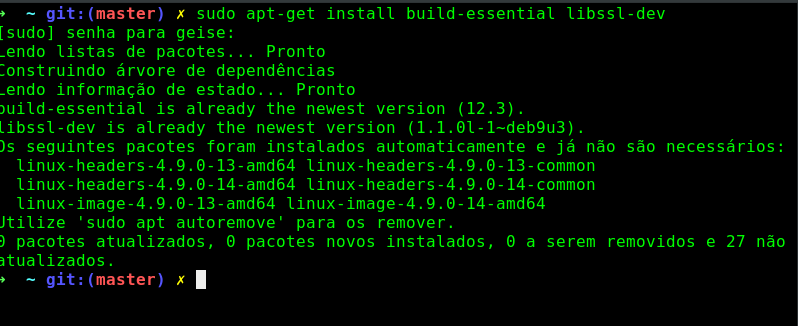
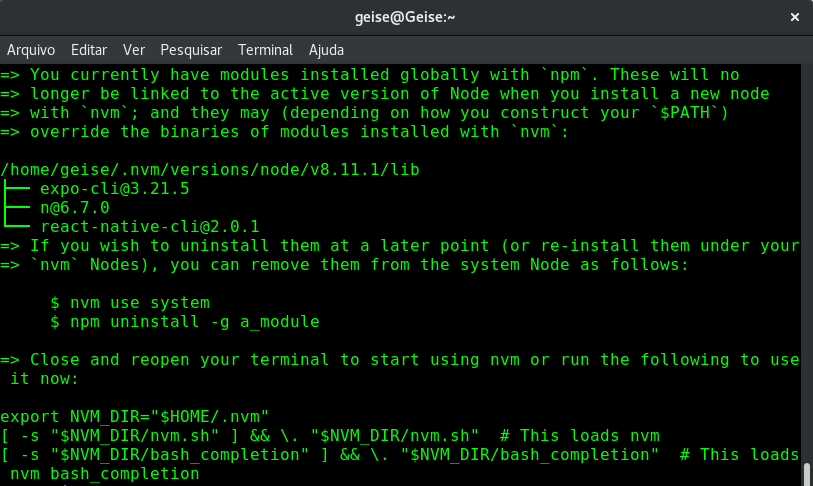
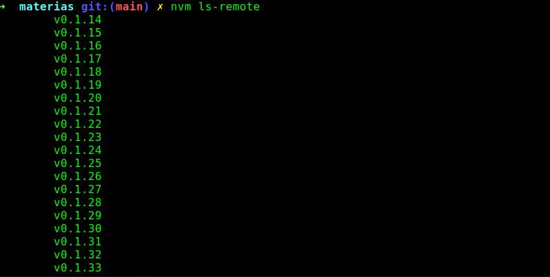
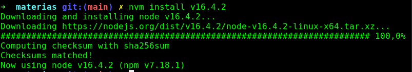

## 
 Tutorial de instalação do Node Debian 

Fala, galera!

Hoje vim trazer um tutorialzinho de instalaçao do Node para quem, assim como eu, usa a distribuição Debian. Bora lá?

Bom, primeiramente, sugiro instalar o NVM, pois através dele você pode instalar várias versões do Node e ficar alternando entre elas, sem muito esforço.

Mas, antes de instalar o NVM propriamente dito, precisamos de algumas dependências. Nossos primeiros dois comandos estão abaixo:

**Comando 01: sudo apt update**

**Comando 02: sudo apt-get install build-essential libssl-dev**

Devido o meu sistema já possuir essas dependências, a tela apresentada será diferente da sua, mas não tem problema algum. Ao instalar as dependências, você algo assim:

Agora que você já tem o necessário em seu sistema vamos instalar o NVM, através do comando abaixo:

* curl -o- https://raw.githubusercontent.com/creationix/nvm/v0.33.2/install.sh | bash

Não se preocupe, com esse comando o que está sendo feito é o download de um script e a execução do mesmo, tudo vai ser instalado em um diretório oculto na pasta do seu usuário não é necessário utilizar o comando com sudo nesse caso.

Após a instalação você verá algo assim:

Agora, com o comando abaixo você pode exibir várias versões do Node e assim saber se o NVM está funcionando corretamente.

**nvm ls-remote**

Ao executar o comando, você verá uma tela parecida com a que está abaixo:

Com as versões apresentadas, você pode escolher, com o comando abaixo, a versão mais recente e instalar em sua máquina. Suponhamos que você queira instalar a versão 16. O comando seria:

**nvm install v16.4.2**

Ao concluir a instalação, verá uma tela com as seguintes informações:

Pronto, agora o node já está instalado. Porém, o legal do nvm é que você pode trocar de versão utilizando apenas o comando abaixo:

**nvm use <versão desejada>**

Com esse comando você pode usar a versão que desejar.

Prontinho, era isso. Abraços!

