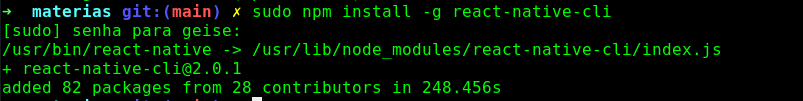
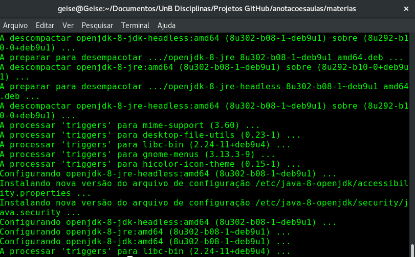

## 
 Tutorial de instalação do React Native no Debian 

Fala, galera!

Hoje vim trazer um tutorialzinho de instalaçao do React Native para quem, assim como eu, usa a distribuição Debian. Bora lá?

Bom, primeiramente, precisaremos do node.js e do JDK. A instalação do node já foi feita no tutorial anterior e a do JDK se encontra mais a frente.

Após a instalação do node, podemos instalar a CLI (Command Line Interface) do React Native, porém você decide se que usar o npm ou o yarn. A instalação pode ser feita através dos comandos abaixo:

**sudo npm install -g react-native-cli**

**yarn global add react-native-cli**

Obs: insira os comandos levando em consideração que o npm ou yarn já estejam instalados em sua máquina. Caso contrário utilize os comandos:

**sudo apt install npm ou sudo apt install yarn**

Ao instalar a CLI, você verá uma tela parecida com a apresentada abaixo:

Agora vamos a instalação do JDK com os três comandos abaixo:

**sudo add-apt-repository ppa:openjdk-r/ppa**

**sudo apt-get update**

**sudo apt-get install openjdk-8-jdk**

Ao concluir a instalação, você verá algo mais ou menos assim:

Agora falando em libs gráficas, em grande parte das vezes precisamos instalar algumas bibliotecas da versão 32bits do Linux para conseguir emular nosso projeto e para isso vamos utilizar o seguinte comando:

**sudo apt-get install gcc-multilib lib32z1 lib32stdc++6**

Agora que as configurações foram feitas, o ambiente está pronto para uso. 

Para trabalhar com mais agilidade e produtividade, você pode baixar o emulador chamado **Genymotion.** Ele está disponível em: 
* [Documentação para instalação do emulador](https://docs.rocketseat.dev/ambiente-react-native/android/emulador)

Prontinho, era isso. Abraços!
