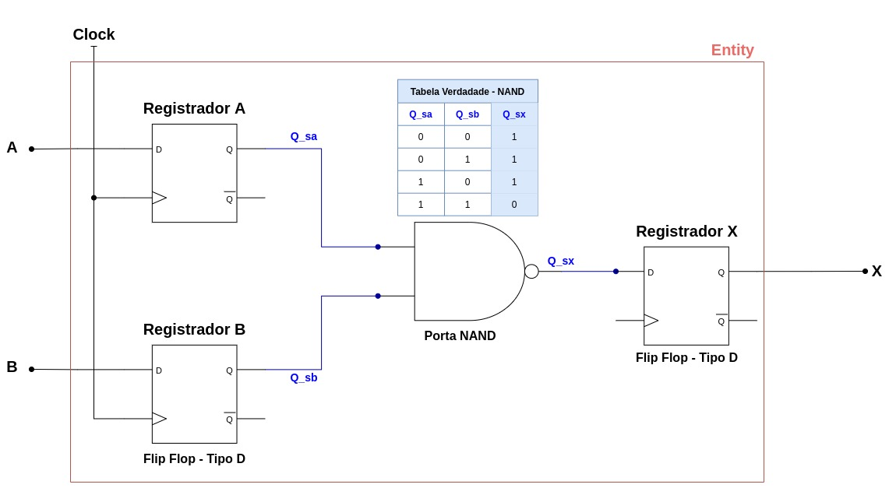

Prova 02 - Embarcados

### 1) Construa um circuito com portas lógicas que permitam modificar as saídas quando processadas. O circuito deverá receber como entrada um registrador A e B e a resposta deverá ser armazenada em X. A Saída deverá inverter o resultado do processamento. Após a construção do circuito, codifique-o usando VHDL. 

~~~VHDL
LIBRARY IEEE;
USE IEEE.STD_LOGIC_1164.ALL;

entity Reg_FlipFlop is
	Port ( D,Clk : in STD_LOGIC;
    	   Q, QN : out STD_LOGIC);
end Reg_FlipFlop;

architecture Behavioral of Reg_FlipFlop is
begin

	D_FF:
    process (Clk)
    begin
    	if Clk'event and Clk='1' then
        	Q <= D;
            QN <= not D;
        end if;
    end if;
    end process;
    
end Behavioral;
~~~
### **Testbench**

~~~VHDL
LIBRARY IEEE;
USE IEEE.STD_LOGIC_1164.ALL;

entity questao1 is

port

( A, B, Clk: in STD_LOGIC;
  X: out STD_LOGIC);

end questao1;

architecture code of questao1 is

    signal X_s, Clk_s, Q_sa, QN_sa, Q_sb, QN_sb, Q_sx, QN_sx: STD_LOGIC;
    
    component Reg_FlipFlop is
    	Port ( D,Clk : in STD_LOGIC;
    	       Q, QN : out STD_LOGIC);
    end component;

begin
  
  A_s <= A;
  B_s <= B;
  X <= Q_sx;
  Clk_s <= Clk;
  
  Registrado_A: Reg_FlipFlop port map (A, Clk_s, Q_sa, QN_sa);
  Registrado_B: Reg_FlipFlop port map (B, Clk_s, Q_sb, QN_sb);
  Registrado_X: Reg_FlipFlop port map (X_s, Clk_s, Q_sb, QN_sb);
    
    X_s <= not(Q_sa and Q_sb);
    
end code;
~~~

### 2) Codifique o circuito desenvolvido na questão 1 em linguagem de programação Rust.

~~~Rust
#![allow(dead_code)]
// estrutura de unidades sem recurso do Rust
#[derive(Debug, Copy, Clone, PartialEq)]
// colocar para me localizar no codigo

enum InOut { // referenciando bits
    E, // em termos de tabela verdade seria 0
    S, // em termos de tabela verdade seria 1
}

trait Componente {
    fn update(&mut self, input: &[InOut]) -> Vec<InOut>;
}

fn nandregistration(ax: InOut, bx: InOut) -> InOut {
    match (ax, bx) {
        (InOut::E, InOut::E) => InOut::S,
        (InOut::E, InOut::S) => InOut::S,
        (InOut::S, InOut::E) => InOut::S,
        (InOut::S, InOut::S) => InOut::E,
    }
}

fn nandnumeros(z: &[InOut]) -> InOut {
    match z.len() {
        0 => panic!("Entrada vazia!"),
        1 => nandregistration(z[0], z[0]),
        2 => nandregistration(z[0], z[1]),
        n => nandregistration(z[n-1], nandnumeros(&z[0..n-1])),
    }
}

#[derive(Debug, Copy, Clone)]

struct Portanand {
    num_inputs: usize,
}

impl Portanand  {
    fn new(num_inputs: usize) -> Portanand  {
        Portanand  { num_inputs }
    }
}

impl Componente for Portanand {
    fn update(&mut self, input: &[InOut]) -> Vec<InOut> {
        assert_eq!(self.num_inputs, input.len());
        if input.iter().any(|&ax| ax == InOut::E) {
            vec![InOut::S]
        } else {
            vec![InOut::E]
        }
    }
}

#[derive(Debug, Copy, Clone)]

struct Portanand2 {
    nanda_x: Portanand,
    nandb_x: Portanand,
    nandc_x: Portanand,
}

impl Portanand2 {
    fn new() -> Portanand2 {
        Portanand2 {
            nanda_x: Portanand::new(1),
            nandb_x: Portanand::new(1),
            nandc_x: Portanand::new(2),
        }
    }
}

impl Componente for Portanand2 {
    fn update(&mut self, input: &[InOut]) -> Vec<InOut> {
        // logica para entradas com saidas invertidas
        assert_eq!(input.len(), 2);
        let ax = input[0];
        let bx = input[1];
        let negativa_ax = self.nanda_x.update(&[ax])[0];
        let negativa_bx = self.nandb_x.update(&[bx])[0];
        self.nandc_x.update(&[negativa_ax, negativa_bx])
    }
}

fn main(){
    let mut porta_or = Portanand2::new();
    let mut cont = vec![InOut::E, InOut::E];
    println!("{:?} = {:?}", cont, porta_or.update(&cont));
    cont = vec![InOut::E, InOut::S];
    println!("{:?} = {:?}", cont, porta_or.update(&cont));
    cont = vec![InOut::S, InOut::E];
    println!("{:?} = {:?}", cont, porta_or.update(&cont));
    cont = vec![InOut::S, InOut::S];
    println!("{:?} = {:?}", cont, porta_or.update(&cont));
}
~~~
### 3) Sobre a Co-síntese no desenvolvimento Hardware/Software Co-designer é correto dizer que:

**Resposta:** 

Co-síntese é o mapeamento automático do protótipo virtual para o protótipo real, de tal forma que todas as restrições são satisfeitas.

### 4) Implementação Hardware/Software

### Design

A implementação de Hardware/Software é um processo que se restringe a 3 etapas a sua conclusão. A primeira etapa, chamada design, é a de desenho da descrição do projeto combinacional e sequencial da arquitetura. Este visa a estruturação da lógica que será empregada para a formação do diagrama lógico. E utilizado então a escrita com VHDL.

### Síntese
Em seguida a próxima etapa do processo é a de síntese, este visa a construção da lógica combinacional que foi descrita pelo código VHDL no passo anterior. Tendo como resultado um diagrama lógico funcional. 

### Implementação
Através deste diagrama então podemos gerar a última etapa de implementação. Nela formaremos um netlist dos componentes eletrônicos que serão utilizados e sua topologia. Com isso pode ser gerado o esquemático de implementação do circuito formado através da lógica do algoritmo inicial proposto em VHDL.

### 1) Codifique o circuito desenvolvido na questão 1 em linguagem de programação C.

~~~C
#include <stdio.h> 
#include <stdlib.h> 

int main() { 

    int Q_sa[4] = { 0, 0, 1, 1 }; 

    int Q_sb[4] = { 0, 1, 0, 1 }; 

    int cont, Q_sx; 

    printf("Coloque a tabela verdade NAND aqui"); 

    for (cont = 0; cont < 4; cont++) { 

        if (Q_sa[cont] == 1 && Q_sb[cont] == 1) 
            Q_sx = 0;
        else
            Q_sx = 1;
        printf("\n %d PORTA NAND %d = %d", Q_sa[cont], Q_sb[cont], Q_sx); 
    } 
}
~~~
