# 
Metodologias

A Engenharia de Requisitos executa as mesmas atividades em todos os tipos de processos, porém, cada metodologia possui uma forma diferente de relizar essas atividades. Portanto, para desenvolver um poduto de software, o primeiro passo é adotar uma metodologia de trabalho. Dentro da metodologia escolhida, existem modelos disponíveis para uso que seguirão o modo de pensar da metodologia que o abarca mas especificará como será o processo e quais os procedimentos, métodos e ferramentas que devem ser utilizados. 

Esses conceitos se relacionam da seguinte forma: 

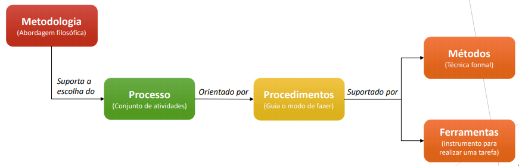

As metodologias sao divididas em **tradicionais** e **ágeis**.

A metodologia **tradicional** é aquela que possui uma base muito forte em documentação, o software é todo planejado e documentado antes de ser implementado. Na época em que foi criada, o custo de fazer alterações e correções em um produto era muito alto, uma vez que o acesso aos computadores era limitado e não existiam ferramentas de apoio ao desenvolvimento do software. Por isso os métodos tradicionais são pouco adaptáveis às mudanças, são métodos mais "engessados".

Já a metodologia **ágil** é aquela que preza muito mais pela comunicação em tempo real, cara a cara, em detrimento dos documentos escritos. Ela carrega esse nome, ágil, não por possuir processos rápidos, mas porque seu surgimento foi justamente em contrapartida aos métodos tradicionais, que também eram conhecidos como métodos "pesados". Nos métodos ágeis, o cliente é incorporado com parte da equipe, auxiliando nas tomadas de decisão e acompanhando ativamente todo o desenvolvimento do produto. Os métodos ágeis são super adaptados às mudanças, seus ciclos são menores e iterativos. 

> Alguns valores da metodologia ágil são:
> - Indivíduos e iterações mais que processos e ferramentas;
> - Software funcional mais que documentação abrangente;
> - Colaboração do cliente mais que negociação de contratos;
> - Responder a mudanças mais que seguir um plano.

O **ciclo de vida** é a estrutura contendo processos, atividades e tarefas envolvidas no desenvolvimento, operação e manutenção de um produto de software, abrangendo a vida toda do produto, desde a definição de seus requisitos até o término de seu uso. O modelo de ciclo de vida é a primeira escolha a ser feita no processo de software. A partir desta escolha, serão definidas desde a maneira mais adequada de obter as necessidades do cliente, até quando e como o cliente receberá sua primeira versão do sistema.

## Ciclos de vida - Tradicionais

🔸**Cascata**: esse é o modelo mais antigo, talvez até o primeiro modelo, e tem esse nome por ser um modelo sequencial, uma fase depende da outra (o fim de uma fase marca o início da outra). O principal aqui são as análises e projeto do sistema antes de começar a implementação. Esse modelo pode ser bom para um projeto pequeno e bem definido desde o início, algo que provavelmente não terá mudanças.

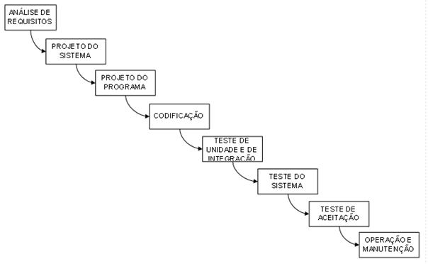

<!-- 
| 
Vantagens | 
Desvantagens |
|------------------|---------------------|
| Modelo de fácil entendimento para o cliente | Não prevê nenhuma revisão das fases | 
| Início e fim bem claros e definidos | Não permite mudanças de requisitos |
| Estimativa de custo precisa logo no início do projeto | Pouquíssima comunicação com o cliente, então, dá incerteza tanto para desenvolvedores quanto para o cliente |
| Facilita o controle gerencial pois produz um artefato ao final de cada fase | | -->

🔸 **Modelo em V**: é, basicamente, um cascata colocado em forma de V, a diferença é que esse modelo prevê verificação e validação (V&V) das fases. O cliente continua recebendo a primeira versão do produto ao final do ciclo, mas esse ciclo reduz os riscos porque planeja testes nas fases de análise e projetos. 

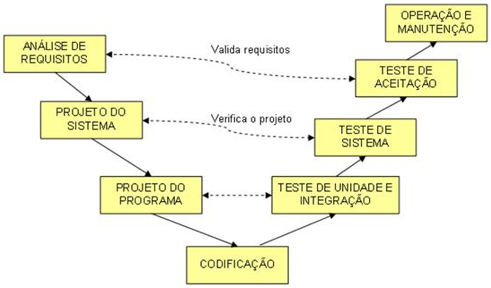

🔸 **Espiral**: esse nome se dá pelo fato de que a cada “volta” ou iteração são geradas versões mais evoluídas do sistema. Nesse modelo, as falhas não são "toleráveis" (pelo menos é o que se espera) e, pra isso, a cada iteração há uma atividade dedicada à análise de riscos e apoiada através de geração de protótipos, que podem ser de baixa fidelidade, desde que ele permita um envolvimento constante do cliente nas decisões. Cada volta é uma fase do ciclo de vida do projeto.

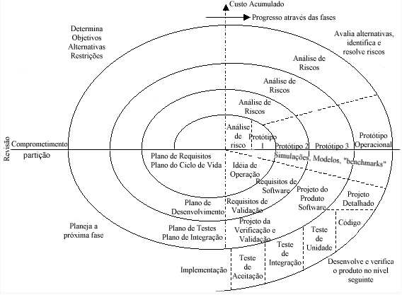

🔸 **Incremental**: neste modelo, os requisitos do cliente são obtidos e agrupados em módulos de acordo com a funcionalidade. Após este agrupamento, a equipe, junto ao cliente, define a prioridade em que cada módulo será desenvolvido, e essa escolha é baseada na importância daquela funcionalidade ao negócio do cliente. Cada módulo passa por todas as fases do cascata, então, o cliente recebrá uma versão do produto final em menos tempo.

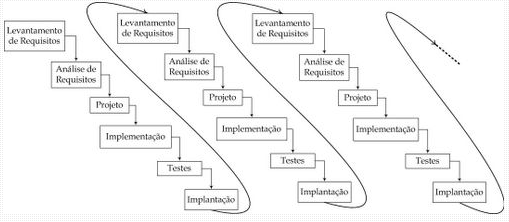

🔸**Evolutivo**: neste modelo, os requisitos são levantados em paralelo ao desenvolvimento porque pressupõe-se que o cliente não irá expor todos os requisitos desde o início do processo, ou os requisitos não são tão bem conhecidos, ou ainda estão sofrendo mudanças. Assim, a análise é feita em cima dos requisitos conseguidos até então, e a primeira versão é entregue ao cliente, que vai gerar feedbacks. Esses feedbacks geram nova análise, projeto e desenvolvimento, e uma segunda versão do software é entregue ao cliente que, novamente, retorna com mais feedbacks. Assim, o software vai evoluindo, se tornando mais completo, até atender todas as necessidades do cliente dentro do escopo estabelecido. 

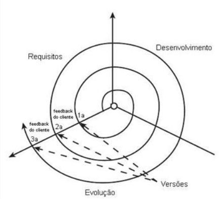

🔸**RAD (*Rapid Application Development*)**: este modelo é como uma evolução da “prototipagem rápida" e é um ciclo extremamente curto, chegando a ter exemplos de ciclos que duraram de 60 a 90 dias. A diferença principal deste ciclo para o espiral é o forte paralelismo das atividades, onde os módulos são mais independentes e os incrementos são desenvolvidos ao mesmo tempo, por equipes diferentes.

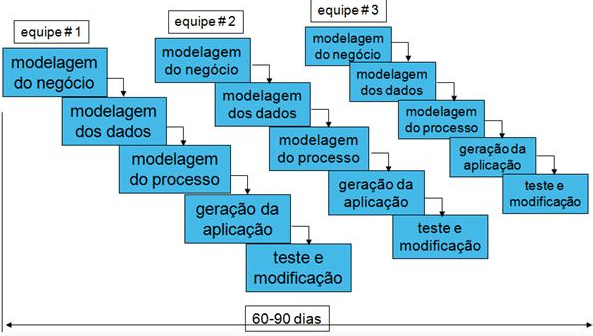

## Ciclos de vida - Ágeis

🔸**Scrum**: os projetos aqui são divididos em ciclos chamados de Sprints. O **Sprint** representa um período onde um conjunto de atividades deve ser executado. As funcionalidades totais a serem implementadas no projeto são mantidas em uma lista chamada de **Product Backlog**. No início de cada Sprint, é feito um **Sprint Planning**, ou seja, uma reunião de planejamento onde o Product Owner prioriza os itens do Product Backlog e a equipe seleciona as atividades que ela será capaz de implementar durante o Sprint que se inicia. As tarefas definidas para um Sprint são transferidas do Product Backlog para o **Sprint Backlog**. Existe ainda uma reunião rápida que ocorre todos os dias, chamada **Daily**, cujo objetivo é manter a equipe informada sobre o que foi feito no dia anterior, identificar impedimentos e priorizar o trabalho do dia que se inicia. A daily não é uma "prestação de contas" para a equipe, serve apenas para informar o que foi feito que tenha contribuído para a sprint em quetão.

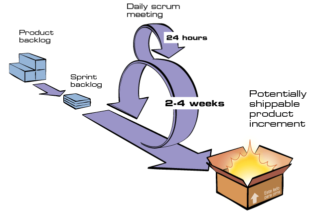

🔸**Kanban**: o Kanban é a metodologia ágil mais antiga, inspirada nos métodos dos japoneses para organizar o fluxo de trabalho nas fábricas. Para software, esse sistema é utilizado nos famosos quadros com post-its, ou em plataformas como o Trello, que oferecem uma visão geral do andamento das tarefas do projeto. A ideia é ser um método simples e visual para que todos compreendam e acompanhem as tarefas, projetos e responsabilidades da equipe. O principal funcionamento desse método é ter um quadro dividio em *To do*, *Doing* e *Done*, embora possam haver outros campos como de testes e etc, onde as pessoas vão movendo os cartões de uma coluna para outra à medida em que as atividades são realizadas.

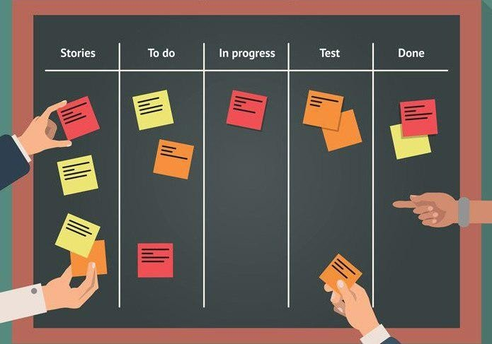

🔸**XP (*eXtreme Programming*)**: XP é uma modelo baseado em comportamentos e atitudes. Dessa forma, ela propicia que o projeto seja executado dentro do prazo e do orçamento, prezando por simplicidade, comunicação e feedback. Esse método requer muita disciplina e exige alguns comportamentos específicos, como:
- Cliente ativo: constante disponibilidade do cliente para colaborar em dúvidas, alterações, e prioridades em um escopo, ou seja, dando um dinamismo ativo ao projeto;
- Metáforas: caso seja possível, é estabelecido o uso de metáforas em pontos chaves ao projeto como, por exemplo, a definição de um nome que seja comum à equipe e simbolize algo de fácil assimilação;
- Planejamento: uma espécie de sprint planning junto ao cliente para planejar quais requisitos serão atnedidos durante aquele iteração;
- Releases pequenas: Conforme as interações são concluídas, o cliente recebe pequenas versões/releases do sistema, visando com que seja colocado em prática e validado aquilo que está sendo implementado;
- Testes de aceitação: são definidos pelo usuário na fase inicial do projeto e são os critérios de aceitação do software conforme a estratégia de entrega;
- Testes em primeiro lugar: aplicados a partir de testes unitários do código produzido, além de serem preparados utilizando os critérios de aceitação definidos previamente pelo cliente;
- Integração contínua: os diversos módulos do software são integrados diversas vezes por dia e todos os testes unitários são executados. O código não passa até obter sucesso em 100% dos testes unitários;
- Simplicidade: ocódigo está sempre na forma mais simples e mais clara, conforme os padrões definidos pela equipe de desenvolvimento, facilitando a compreensão e possível continuidade por qualquer um dos membros; 
- Refatoração de código: a cada nova funcionalidade adicionada, é trabalhado o design do código até ficar na sua forma mais simples, mesmo que isso implique em "mexer" em um código que esteja em funcionamento.

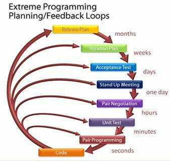

🔸**Lean**: esse nome, lean, vem do conceito de Lean Manufacturing (Manufatura Enxuta), originário do Sistema Toyota de Produção. Basicamente, o propósito é gerenciar o negócio de forma mais rápida, mais barata e melhor, alocando somente os recursos necessários para cada projeto e ciclo iterativo. Para isso, o modelo abrange ferramentas como o Business Canvas Model e Customer Development, que simplificam e agilizam as estratégias do negócio. É um bom método para usar "combinado" com os métodos Scrum ou Kanban, pois auxilia ainda mais no processo de gestão do projeto.

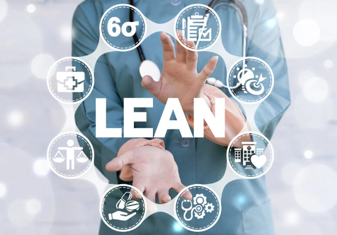

### 📌 Referências
* [Metodologias tradicionais](https://www.semeru.com.br/blog/as-metodologias-tradicionais-de-desenvolvimento-de-software/)
* [Metodologias Ágeis](https://www.semeru.com.br/blog/as-metodologias-tradicionais-de-desenvolvimento-de-software/)
* [Cascata](https://casadaconsultoria.com.br/modelo-cascata/)
* [Espiral](https://medium.com/contexto-delimitado/o-modelo-em-espiral-de-boehm-ed1d85b7df)
* [Scrum](https://www.desenvolvimentoagil.com.br/scrum/)
* [XP](https://www.devmedia.com.br/extreme-programming-conceitos-e-praticas/1498)
* [Outros modelos ágeis](https://neilpatel.com/br/blog/metodologia-agil/)