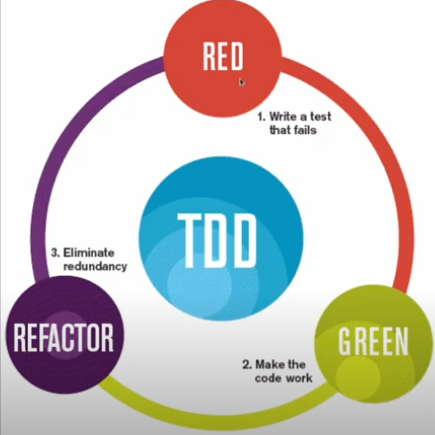

# <center>TDD - Test-Driver Development

<div align="justify">

O teste TDD significa Desenvolvimento Orientado a Testes, ou seja, os testes são escritos antes do código ser desenvolvido. São pequenos ciclos em que primeiro é criado um teste e depois desenvolvida uma funcionalidade para passar nesse teste. O ciclo se divide basicamente em "linha vermelha" > "linha verde" > "refatoração" (Red, greed, refactor). 

Primeiro escreve-se o teste e ele vai falhar (linha vermelha) porque não existe uma funcionalidade para ele. Depois, escreve-se a funcionalidade que vai passar neste teste (linha verde) e, em seguida, a funcionalidade precisa ser refatorada para garantir que esteja descrita de acordo com as boas práticas de programação. Isso vai deixar o código mais limpo, coeso e menos acoplado.

**Resuminho:**

* Escrever um Teste que inicialmente não passa (Red);
* Adicionar uma nova funcionalidade visando aquele teste;
* Fazer a funcionalidade passar no teste (Green);
* Refatorar o código da nova funcionalidade (Refactoring);
* Escrever o próximo teste.

<div align="center">


</div>

A ideia é, após escrever o código (lembrando que ele não vai passar mesmo) codificar a nova funcionalidade da forma mais simples possível para fazer o teste passar, sempre com a seguinte sequência em mente: **Código que funciona -> Código simples e limpo -> Código rápido**. É o famoso KISS, "Keep It Simple, Stupid" 😂😂

Pra fazer um teste desse em java, é preciso ter o JDK - Java Development Kit (que já vem com compilador, JVM, JRE, etc) + Eclipe + JUnit.

**JDK - Java Development Kit**
```
sudo apt install default-jdk
java --version
```
**Eclipse**
```
Entre em "Gerenciador de aplicativos" do linux e instale o Eclipse 
```

**Como fazer o teste**
O teste TDD é, basicamente, dividido em


</div>

### 📌 Referências
[TDD - Exemplo de teste em Java](https://www.devmedia.com.br/test-driven-development-tdd-simples-e-pratico/18533#:~:text=TDD%20%C3%A9%20o%20Desenvolvimento%20Orientado,do%20nosso%20c%C3%B3digo%20de%20produ%C3%A7%C3%A3o!)

[Livro TDD - Kent](testes/Livro_TDD_Kent-Beck.pdf)