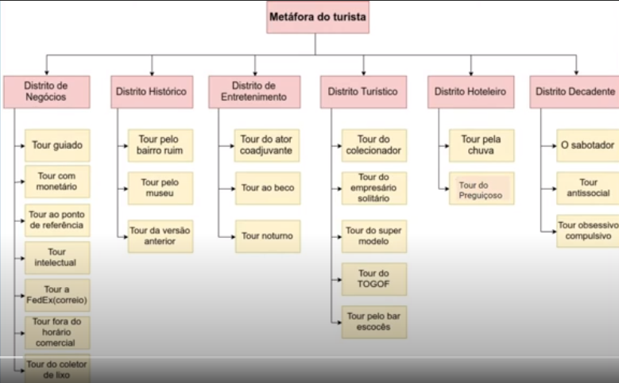

# 
Testes Exploratórios

Os testes exploratórios buscam descobrir como o software realmente funciona e fazer perguntas sobre como ele irá lidar com casos difíceis e fáceis. Explorar é vagar de propósito em um espaço, com uma missão geral mas sem ter a rota pré estabelecida.

A qualidade do teste depende da habilidade do testador de inventar casos de teste encontrar defeitos e quanto mais o testador sabe sobre o produto e diferentes métodos de teste, melhor será o teste.

A documentação dos testes exploratórios varia entre documentar todos os testes realizados ou apenas documentar os bugs. Além de bugs funcionais podem ser identificados problemas de layout, UX, regras de negócios que não estão claras e outros pontos relevantes para as próximas fases do teste.

| 
Vantagens                                       |
Desvantagens |
|:--------------------------------------------------------|:--------------------|
| Muito usado quando existe pouca ou nenhuma documentação | A sua eficiência depende da experiência/habilidade|
| Aumentam as variações dos testes                        | Necessitam de certa experiência no domínio |
| Criam novos cenários para testes                        | Não devem ser levados como principal abordagem de teste |
| Incentiva a discussão do time sobre os itens            | |

## Metáfora do turista - Whitaker
Essa metáfora é uma alusão a um viajante visitando uma grande cidade, com pouco tempo, e que sem um guia ele não vai conseguir conhecer a cidade. Então, precisa fazer uma estratégia para o turista conseguir aproveitar o tempo e guiar as decisões. A mesma ideia é associada ao testador de software que deseja explorar um software complexo ou desconhecido, pois ele tem que escolher a **estratégia** e definir as **metas** pra conseguir atingir um objetivo específico.

### Planejamento do turista
Um bom turista é aquele que, ao planejar sua viagem, divide seu destino em distritos (comercial, entretenimento, teatro, etc). Fazendo a associação, um bom testador pode dividir o sistema em **distritos**, seguindo um critério lógico. Cada distrito é subdividido em **tipos de tour**, conforme apresenta a tabela abaixo.

#### 
 Distrito de Negócios

É o local onde os negócio são feitos, com hora do rush e hora de horário comercial. Em software seria sistemas que dependem da inicialização de ...... prontos pra uso. Esse distito tem 7 tours:

* **Tour guiado (tour F1 ou guidebook tour)**: basicamente, significa seguir, à risca, o manual do usuário. O objetivo é executar cada passo do manual de modo mais fiel possível, assim, avalia-se a habilidade do software de fazer o que foi prometido e também a precisão do manual do usuário;

* **Tour com monetário (money tour)**: vai verificar a coerência das funcionalidades de uma versão demonstrativa do produto com as especificações do sistema, com aquilo que foi prometido. O objetivo é detectar inconsistências entre o que foi entregue ao cliente e o que foi prometido. Pra fazer esse tour, é preciso observar as demonstrações de vendas e procurar os erros, procurar as inconsistências com o produto;

* **Tour ao ponto de referência (Landmark tour)**: vai procurando por pontos de referência. Define um ponto e vai até ele; de lá, vai até outro, e assim sucessivamente. É como o jogo de ligar pontinhos. O objetivo é avaliar a interação de diferentes características do produto quando executados em diferentes sequências. Pra fazer esse tour, é necessário: escolher uma _lista de pontos de referência_ (selecionando características chave, com base no tour guiado ou no tour monetário) > definir a _ordem_ desses pontos > ir explorando de um ponto ao outro até ter passado por todos os pontos > manter uma lista de quais pontos foram visitados pra ter um rastreamento do progresso (tipo um grafo);

* **Tour intelectual**: O objetivo é fazer perguntas difíceis para o software em teste; isso ajuda a detectar falhas na lógica do sistema, tanto de aspecto complexo quanto simples;

* **Tour a correio (FedEx tour)**: brincar de mover dados (informações) pelo software. Um dado entra, você vai mandando ele pra lá, pra cá, e em algum ponto ele vai sair. O objetivo é identificar cada característica que influencia e sofre influência sobre o dado, e possíveis pontos nos quais os dados são corrompidos em função do processamento desse dado (tu moveu tanto que talvez, em algum ponto, ele tenha sido corrompido);

* **Tour fora do horário comercial (After Hour tour)**: é o momento em que a função principal não estpa mais rodando mas muitas aplicações continuam trabalhando (tarefas de manutenção, backup de arquivos, etc). O objetivo é identificar falhas durante a execução dessas tarefas "after hours". Pra fazer isso é necessário identificar as funções que o software faz quando não está mais fazendo o trabalho principal e fazê-las ser executadas;

* **Tour do coletor de lixo (Garbage collector)**: é uma avaliação metódica e em blocos, gastando pouco tempo em cada lugar. Pra fazer esse tour é preciso definir o objetivo (ex.: todos as caixas de diálogo, todas os itens do menu, etc) e visitar cada um deles usando o menor caminho possível. Esse daqui é basicamente você ir fazendo uma varredura sobre as coisas mais óbvias, os "lixinhos pequenos" geralmente ficam pra trás mesmo, esse tour é pra dar uma geralzona no sistema.

#### Distrito histórico
Esse distrito aqui tem como objetivo testar os softwares **legados**, suas inúmeras versões, modificações e defeitos antigos.

* **Tour ao bairro ruim(bad-neighbourhood tour)**: existem áreas de código repletas de defeitos, e são nessas áreas que o testados vai gastar tempo. O objetivo é justamente esse, concentrar o tempo de teste nas áreas mais defeituosas. Pra fazer isso, vai testando as características e anotando o número de defeitos encontrados por características, isso possibilita rastrear quais áreas são mais problemáticas. Quando identificado um defeito, é interessante fazer o "tour coletor de lixo", porque aí ele vai verificar se a correção de um defeito não ocasionou novos defeitos;

* **Tour pelo museu (museum tour)**: esse aqui é a consulta ao código legado pela data da última modificação no repositório ou registros de alterações. Partindo do pressuposto que o código legado tem pouca documentação, esse tour serve pra garantir que as modificações recentes tenham sido testadas. Pra fazer esse tour é necessário identificar um código legado e testar seus artefatos que sofreram alterações recentes;

* **Tour da versão anterior (the prior version)**: executar novamente os cenários e testes das versões anteriores pra garantir que as funcionalidades que o usuário está acostumado continuam funcionando. O objetivo é validar que na nova versão de um software tudo continua funcionando como antes, se as que seriam removidas foram mesmo removidas e garantir que nenhuma funcionalidade tenha se perdido durante essa atualização. 

#### Distrito de entretenimento
Esses são os testes mais tranquilos, que envolvem características que não são as principais do sistema mas que auxiliam as principais, pra garantir que elas estejam integradas de forma consistente.

* **Tour do ator coadjuvante (supporting actor tour)**: o testador se concentra nas características que não são as principais. O objetivo desse tour é garantir que as funções secundárias funcionem corretamente e interajam certinho com as demais. Pra fazer isso é necessário focar a atenção aos elementos que ficam "mais à direta" ou "mais à esquerda" da tela pois ali estarão os elementos secundários;

* **Tour pelo beco (the back alley tour**: testar as características menos prováveis de serem utilizadas, dos bastidores, e as menos atrativas ao usuário. O objetivo disso é exercitar as características pouco exploradas por testes, pois ali pode-se encontrar comportamentos improváveis já que, provavelmente, as pessoas não testaram muito bem. É um ótimo tour para as áreas que não foram testadas;

* **Tour noturno (all-nighter tour)**: o teste não pode parar... é o teste do truvs eterno! "Quanto tempo a aplicação pode durar em execução?", "por quanto tempo a aplicação consegue executar e processar dados antes de entrar em colapso?". O objetivo é desafiar o software inserindo dados e forçando leituras, e a tendência é que ele falhe em algum momento. Pra fazer isso, é necessário aplicar os testes por um longo período de tempo até que se obtenham os resultados.
 ⚠️ Dúvida: isso não é um teste de stress? Qual a diferença?

#### Distrito turístico
Esses testes são breves e com um propósito especial, bem específico. Ele não é para fazer o software funcionar, é pra marcar as funcionalidades ainda não visitadas.

* **Tour do colecionador (collector's tour)**: o testador vai experimentar as coisas, colecionar saídas de software. O objetivo é visitar todos os locais possíveis e documentar toda saída obtida, fazer o software produzir todas as saídas possíveis. É um tour grande, então pra fazer isso é necessário dividir as características pelo grupo e atribuir determinadas saídas pra cada pessoa realizar a coleta dessas saídas.

* **Tour do empresário solitário (lonely businessman tour)**: o objetivo desse tour é testar as características mais distantes do ponto inicial da aplicação. A ideia é sair do ponto mais distante e ir "viajando" até o objetivo ser atingido. Pra fazer isso é preciso saber "qual característica precisa da maior quantidade de cliques pra ser atingida?" e "qual característica precisa-se navegar pela maior quantidade de telas até o objetivo ser atingido?". A resposta dessas perguntas indicam as características a serem testadas;

* **Tour do super modelo (supermodel tour)**: esse tour tem o foco na interface, naquilo que é visto, não nas funcionalidades em si. O objetivo desse tour é encontrar defeitos superficiais relacionados à interface e os elementos apresentados. É importante saber que os produtos que passam por esse teste (são "aprovados") ainda podem ter graves defeitos mas não foram detectados aqui porque apresentam aparência impecável (como um top model mesmo). É bem teste de IHC mesmo;

* **Tour TOGOF**: esse nome é uma adaptação para o acrônimo BOGOF (buy one, get one free), no caso aqui, seria "test one, get one free", e tem esse nome porque indica que se um defeito for encontrado em uma cópia, será encontrado em todas as cópias desta aplicação. É um tour simples pra testar várias cópias de uma mesma aplicação de forma simultânea. O objetivo é identificar possíveis problemas de concorrência e compartilhamento indevido de recursos. Pra fazer isso é necessário começar executando uma aplicação e depois vai executando as outras cópias, de forma que cada cópia seja forçada a executar algo em memória ou disco. Tente fazer todas as cópias abrirem os mesmos arquivos ou transmitir dados pela rede de forma simultânea.

* **Tour pelo bar escocês (scottish pub tour)**: é um tour para grandes e complicadas aplicações, porque são códigos onde os "segredos" dele são passados "boca a boca". O objetivo é verificar se as características mais difíceis de serem encontradas no produto funcionam corretamente. É preciso identificar uma lista das funcionalidades difíceis de serem encontradas e definir casos de testes pra elas. TRUQUE: pra encontrar essas funcionalidades, é preciso começar a busca em grupos de usuários e também gastar bastante tempo percorrendo as profundezas da aplicação. 

#### Distrito Hoteleiro
Representa a oportunidade pro testador deixar de lado as funções principais e focar a atenção dos testes nas funções secundárias e de apoio.

* **Tour da chuva**: são testes que vão identificar os problemas relacionados com a não habilidade de realizar a limpeza do que foi iniciado, como arquivos que continuam abertos e dados mantidos. É natural que o usuário interrompa algumas ações e deseje executá-las novamente, então esse tour é, basicamente, pra testar o botão de cancelar. Para fazer isso é necessário identificar uma lista de operações que consomem tempo para serem executadas, iniciar uma dessas operações e depois interrompê-la. Se existir o botão "cancelar", aperte ele, caso contrário pode tentar esc, voltar do navegador, ou shift + F4. Tente também iniciar uma nova ação sem interromper a outra e tenha a certeza de que uma ação pode ser re executada e completada com sucesso.

* **Tour do preguiçoso (the coach potato tour)**: os testes desse tour são aqueles que vão trabalhar o mínimo possível. Não é porque o testador trabalhe pouco que o software também trabalhe pouco. O objetivo desse teste é fazer o software processar valores padrões adequadamente e deve executar o código de manipulação de campos em branco. Para realizar isso é necessário: em cada campo do formulário, aceitar todos os valores padrão; manter campos de entrada em branco; preencher os formulários com a menor quantidade de dados possível; 
 
#### Distrito decadente
Representa os testes que precisam ser feitos pra evitar que os usuários passem por momentos incômodos.

* **Tour do sabotador**: esse tour tem a intenção de minar a aplicação de todas as maneiras e oportunidades possíveis (como corromper um arquivo ou apagar um arquivo antes de completar a ação, etc). O objetivo é procurar defeitos no produto relacionadas à escassez ou falta de recursos necessários pra completar as ações solicitadas. Para isso, é preciso forçar a aplicação a executar uma ação (existem muitas formas de perturbar o ambiente de execução, como adicionar ou remover arquivos, alterar permissões de acesso, desconectar cabo de rede, etc).

* **Tour do anti social**: nesse tour, pretende-se fazer o oposto do esperado, então, em testes isso significa fornecer os dados de entrada menos prováveis ou inválidos e avaliar o comportamento do software nessas situações foras do comum. Esse tour se divide em 3 sub tours:
    - Oposto: utilizar a entrada menos provável possível pra saber a capacidade de tratamento de erros;
    - Do arrastão: utilizar entradas que nunca deveriam ser fornecidas, ou seja, as entradas inválidas. Isso pra testar se as mensagens de erros são exibidas corretamente;
    - Rumo errado: realizar os testes na ordem errada, ou seja, tentar fazer as coisas fora da ordem "cronológica" da aplicação (ex.: alterar opções de entrega antes de completar a compra). Isso pra verificar se as sequências inválidas passam ou são impedidas.

* **Tour Obsessivo Compulsivo**: o testador vai repetir a mesma ação várias vezes seguidas porque os usuários muitas vezes erram e precisam voltar pra tentar fazer de novo os passos, da maneira que acharem mais intuitivo. Pra saber se o software aceita e não se embaralha com os dados, é preciso identificar uma lista de telas/ funcionalidades que se deseja visitar e fornecer a mesma entrada várias vezes.    

### Níveis de exploração

|    Nível   | Descrição |
|:-----------|-----------|
| Freestyle  | O objeto de teste para ser explorada livremente pelo testador |
| Alto grau de exploração | Alguns objetivos são definidos, mas o teste ainda é livre | 
| Grau médio | Definidos os objetivos + restrições (como coisas que PRECISAM estar nos testes) |
| Baixo grau | Definidos objetivos + alguns passos que devem ser feitos no teste; liberdade para escolher os dados desses passos | 
| Totalmente com script | Definidos os objetivos + passos que devem ser feitos no teste + dados que devem ser usados; sem espaço para exploração. | 

### 📌 Referências
[Explicação no Linkedin](https://www.linkedin.com/pulse/para-que-servem-os-testes-explorat%C3%B3rios-diego-conrado/?originalSubdomain=pt)
 
[Aula da Iolane](https://www.youtube.com/watch?v=9h65WEjmqTg&feature=youtu.be)