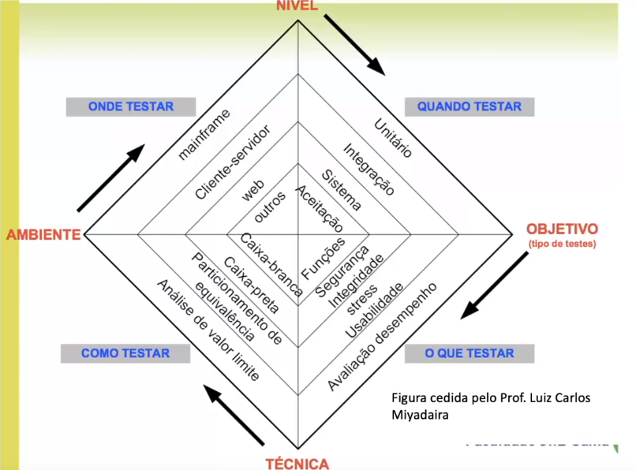

# 
 Testes de Software

Os testes são de extrema importância no processo de desenvolvimento de software, pois visam validar se a aplicação está funcionando corretamente e se atende aos requisitos especificados. Existem diversas técnicas que podem ser aplicadas em diferentes momentos e de diferentes formas para validar os aspectos principais do software.

## Processos
Realizar testes não é apenas uma etapa do projeto, ou uma atividade, é uma fase e requer controle do que é feito e da qualidade disso. Assim como requisitos ou desenvolvimento do software, a fase de testes também exige que exista todo um processo de testes a ser seguido.

De forma geral, o processo de testes de software representa uma estruturação de atividades, etapas, artefatos, papéis e responsabilidades, e independente da metodologia utilizada nos projetos, ele pode ser dividido em sete partes: 
- Planejamento dos testes;
- Especificação dos testes; 
- Modelagem;
- Preparação do ambiente de testes;
- Execução dos testes;
- Registrar resultados;
- Monitorar resultados (reparos de defeitos);
- Avaliar resultados (métricas).

Cada fase dessa está detalhada na primeira parte deste [artigo](https://www.devmedia.com.br/processo-de-teste-agil-x-tradicional/36854).

## Conceitos chave

Cada projeto apresenta características distintas, que dependem do tamanho do software, da tecnologia utilizada para o seu desenvolvimento e de muitos outros fatores. Assim, saber "quando", "o que", "como" e "onde" testar e fazer a escolha adequada para cada um desses é super super importante. 

### 📌 Referências
[Visão geral de testes](https://www.devmedia.com.br/guia/guia-de-testes-de-software/34403#modelagem)

[Testes da metodologia ágil vs. na metodologia tradicional](https://www.devmedia.com.br/processo-de-teste-agil-x-tradicional/36854)