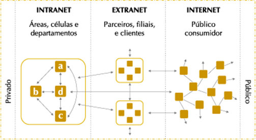

# 
Disciplina: Programação Web

Professor Msc. Aurélio Andrade de Menezes Júnior

Email: aureliomenezesjr@ufam.edu.br

Primeira lista de exercícios. 
Parte 01 Conceitos básicos de Internet e Web
  

**1) Explique como a Internet funciona.**

*Para encontrar e explorar páginas na internet, utiliza-se um navegador de Internet. Esse navegador é um tipo de software que permite acesso à internet, basta inserir um endereço Web no navegador para ser levado a este Website, porém não há um gerenciamento centralizado para a internet, pois atua como uma reunião de milhares de redes e organizações individuais, e cada uma é administrada e sustentada por seu próprio usuário. Vale ressaltar que cada rede colabora com outras redes para dirigir o tráfego na internet, possibilitando que as informações possam percorrê-las.

**2) Explique o que são protocolos.**

*Protoclos são um conjunto de regras que as máquinas adotam para completar tarefas.

**3) O que tem em comum e quais as diferenças da Internet, Intranet e Extranet.**

O funcionamento e a arquitetura da rede é a mesma entre elas. A diferença básica está entre intranet e extranet, em relação a quem gerencia a rede. Em uma intranet, por exemplo, quem gerencia é só uma empresa, enquanto que em uma extranet, os gerentes são as várias empresas que compartilham a rede.

A imagem abaixo exemplifica bem:

**4) Explique, com um exemplo, quais os caminhos por onde passa os dados do usuário que trafegam pela Internet.**

Para ter uma ideia do que acontece, veja o exemplo abaixo do acesso a um artigo online.

Para acessar um artigo online, é preciso abrir o navegador e se conectar ao website que o contém. Ao fazer isso, o computador envia uma requisição eletrônica pela conexão de internet para o provedor de acesso. Este provedor roteia o pedido para um servidor adiante na cadeia da internet. Esse pedido vai atingir um DNS (servidor de nome de domínio). Esse servidor vai então procurar por um nome de domínio que corresponda com o nome de domínio que a pessoa digitou no campo de endereço do navegador (como www.google.com). Se ele encontrar a correspondência, ele vai redirecionar o pedido ao endereço IP apropriado do servidor. Se não encontrar, ele irá enviar o pedido a um nível mais alto da cadeia para um servidor que tenha mais informação. Ao achar o servidor requisitado, ele vai responder enviando o arquivo requisitado em uma série de pacotes. Quando os pacotes chegam até o computador que o requisitou, o dispositivo (computador usado, por exemplo) os arranja de acordo com as regras dos protocolos. É como colocar juntas peças de um quebra-cabeças, e como resultado final, a pessoa vê o artigo.

**5) Conceitue a Web e explique seu funcionamento a partir dos três parâmetros: URL, HTTP e HTML.**

A Web é, então, um sistema de informações interligadas que permitem o acesso de infinitos conteúdos, dos mais variados possíveis, através da Internet. A web, aliada a alguns parâmetros, tem um padrão específico de funcionamento. Esses parâmetros, por sua vez, são URL, HTTP e HTML.

**A Url** serve como um apelido para o IP do servidor. É o endereço Web que introduz em um navegador para chegar a um Website.

**O HTTP** é um protocolo de transferência que possibilita que as pessoas que inserem a URL do seu site na Web possam ver os conteúdos e dados que nele existem.

**O HTML** é o componente básico da web, ele permite inserir o conteúdo e estabelecer a estrutura básica de um website. Portanto, ele serve para dar significado e organizar as informações de uma página na web. Sem isso, o navegador não saberia exibir textos como elementos ou carregar imagens e outros conteúdos.