# 
Disciplina: Programação Web

Professor Msc. Aurélio Andrade de Menezes Júnior

Email: aureliomenezesjr@ufam.edu.br

Primeira lista de exercícios, parte II. 
Conceitos básicos de Internet e Web.
Principais elementos da linguagem HTML
  

**1) Explique o que é um Elemento, um Atributo, uma tag de abertura e uma
tag de fechamento e o conteúdo do elemento na linguagem HTML. Mostre
através de um exemplo.**

**Elemento:** é qualquer objeto identificável dentro do documento que está sendo escrito utilizando o html. Eles são agrupados por função para ajuda-lo a achar o que quer fácilmente. 
* Como exemplo, cito o próprio elemento html. O elemento HTML, (ou HTML root element) representa a raiz de um HTML ou XHTML documento. Todos os outros elementos devem ser descendentes desse elemento. 

* Exemplo: 

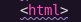

**Atributo:** são comandos ou informações específicas que damos a uma tag, para que ela faça tal comando, porém com algum detalhe ou variação específica, em relação a tag original sem atributos.
Por exemplo, temos o atributo title. Ele adiciona um título (um pop-up) para todo elemento do conteúdo. 

* Exemplo: 
  
  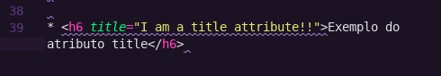

**Tag de abertura:** consiste no nome do elemento (no caso, p), envolvido em parênteses angulares de abertura e fechamento. Isso demonstra onde o elemento começa, ou onde seu efeito se inicia — nesse caso, onde é o começo do parágrafo.
* Exemplo: 

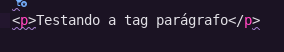

**Tag de fechamento:** isso é a mesma coisa que a tag de abertura, exceto que inclui uma barra antes do nome do elemento. Isso demonstra onde o elemento acaba — nesse caso, onde é o fim do parágrafo.
* Exemplo: 
  
  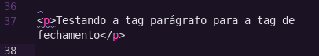
**Conteúdo do elemento na linguagem HTML:** é o que está inserido dentro do elemento, que nesse caso é apenas texto, como mostra abaixo:
* Exemplo:
  
  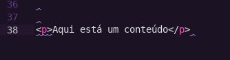 

**2) Quais as tags estruturais de um documento HTML? Mostre através de um exemplo o posicionamento de cada um.**

* Exemplo:

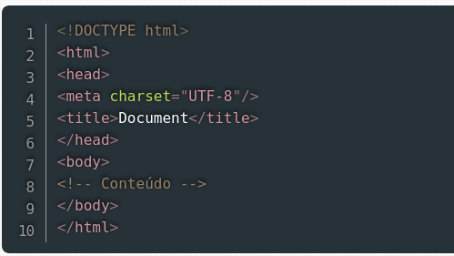

**3) O que é um documento HTML aninhado? Mostre com um exemplo.**

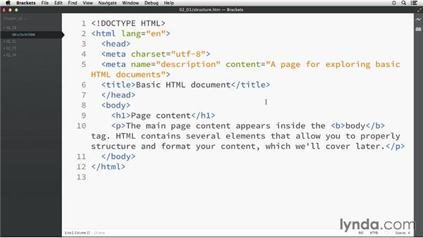

**4) Exercício prático:**

Construa uma página Web com os seguintes elementos
HTML:

a. Elementos estruturais.

b. p, H1, a, br, comentários, title, link, Style, meta, img, table, tr, td

* **Código fonte desenvolvido pela aluna na IDE VScode:**

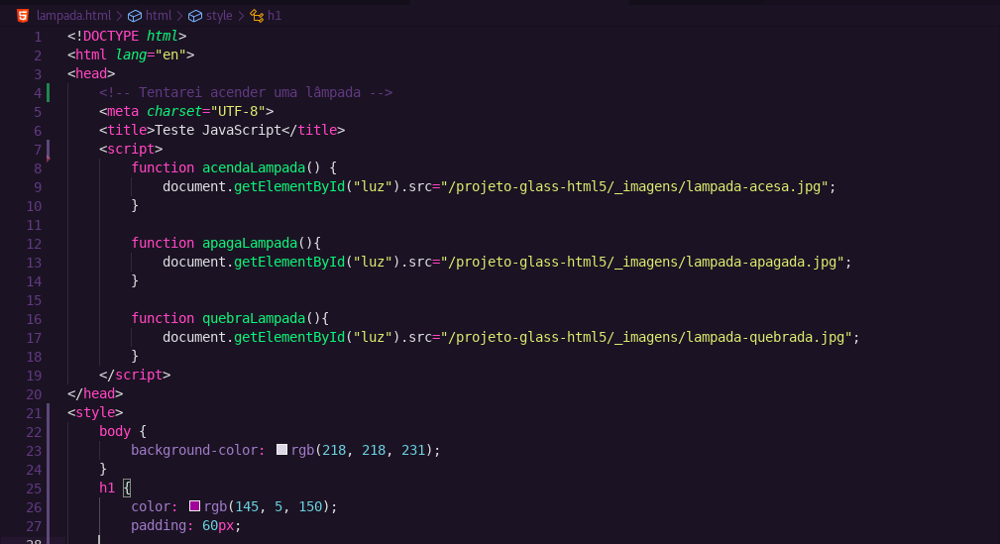

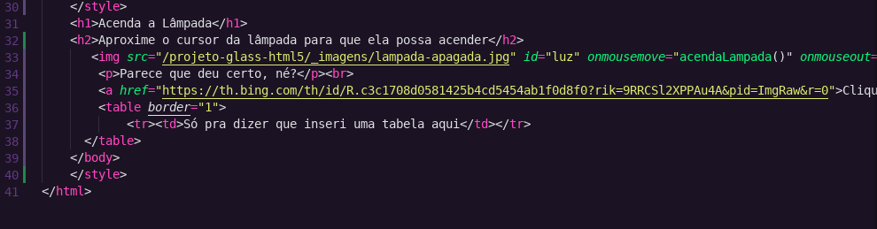

* **Representação na página web:**

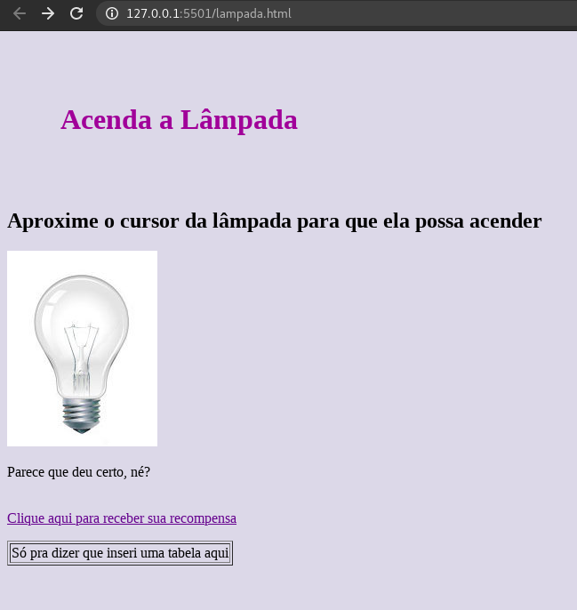
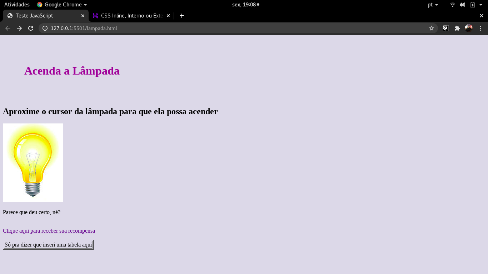